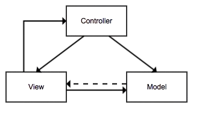

Here’s an example of a well-structured, informative, and visually appealing `README.md` file for your Symfony project. This example includes an introductory image, clear sections, and detailed instructions.

---

```markdown
# My Symfony Project

 <!-- Replace with your image URL or path -->

## Overview

Welcome to **My Symfony Project**! This project is a web application built with Symfony, showcasing various routes, JSON responses, and a structured API landing page. It demonstrates Symfony's powerful routing, controller, and response features to create a flexible and responsive application.

## Table of Contents

- [Overview](#overview)
- [Features](#features)
- [Getting Started](#getting-started)
- [Installation](#installation)
- [Running the Application](#running-the-application)
- [Available Routes](#available-routes)
- [Project Structure](#project-structure)
- [License](#license)

## Features

- **Dynamic JSON Routes**: Provides JSON responses for various routes, including random numbers and quotes.
- **API Landing Page**: A dedicated landing page for API routes, with links and descriptions of available endpoints.
- **Random Quotes API**: Returns a quote of the day with the current date and timestamp.
- **Extensible Structure**: Easy to add more routes and functionality as needed.

## Getting Started

These instructions will help you set up the project on your local machine for development and testing.

### Prerequisites

Before you begin, ensure you have the following installed:

- **PHP 8.x**
- **Composer** (Dependency manager for PHP)
- **Symfony CLI** (Optional but recommended for easier server management)

## Installation

1. **Clone the Repository**

   Clone the repository to your local machine using Git:

   ```bash
   git clone https://github.com/yourusername/yourrepository.git
   ```

2. **Navigate to the Project Directory**

   ```bash
   cd yourrepository
   ```

3. **Install Dependencies**

   Use Composer to install the project's dependencies:

   ```bash
   composer install
   ```

4. **Set Up Environment Variables**

   Create a `.env.local` file to set up local environment variables if needed (e.g., database credentials).

### Running the Application

To start the application, use the Symfony CLI:

```bash
symfony serve
```

If you're not using Symfony CLI, you can also use PHP’s built-in server:

```bash
php -S 127.0.0.1:8000 -t public
```

Once the server is running, open your browser and go to [http://127.0.0.1:8000](http://127.0.0.1:8000).

## Available Routes

The application provides the following routes:

- `/api` - **API Landing Page**: Displays a summary of available JSON routes on this site.
- `/api/lucky/number` - **Lucky Number**: Returns a random lucky number in JSON format.
- `/api/quote` - **Quote of the Day**: Returns a random quote with the current date and timestamp in JSON format.
- `/` or `/home` - **Home Page**: Renders the homepage with links to explore the site.
- `/about` - **About Page**: A simple "About" page with project information.

## Project Structure

This project follows a standard Symfony structure with the following key folders:

- `src/Controller`: Contains controllers that manage routes and responses.
- `templates/`: Stores Twig templates for rendering HTML pages.
- `config/`: Contains configuration files, including routes and services.
- `public/`: The document root for the server, where the front controller (`index.php`) is located.

## License

This project is licensed under the MIT License. See the [LICENSE](LICENSE) file for details.

---

Happy coding! If you have any questions or encounter issues, feel free to open an issue or contact me directly.
```

---

### Explanation of Each Section

1. **Introductory Image**: Adds visual appeal at the top of the README.
2. **Overview**: Brief introduction to the project.
3. **Table of Contents**: Quick navigation for larger README files.
4. **Features**: Highlights key features of the application.
5. **Getting Started**: Provides prerequisites and setup steps for new users.
6. **Installation**: Detailed instructions to clone the repo and install dependencies.
7. **Running the Application**: Explains how to start the server and access the site.
8. **Available Routes**: Lists available routes with brief descriptions.
9. **Project Structure**: Explains the structure for easier navigation and understanding.
10. **License**: Specifies the project’s license.

This `README.md` is designed to give a complete overview of the project, help users get started quickly, and provide clear instructions for installation and usage.
# mvc-24
