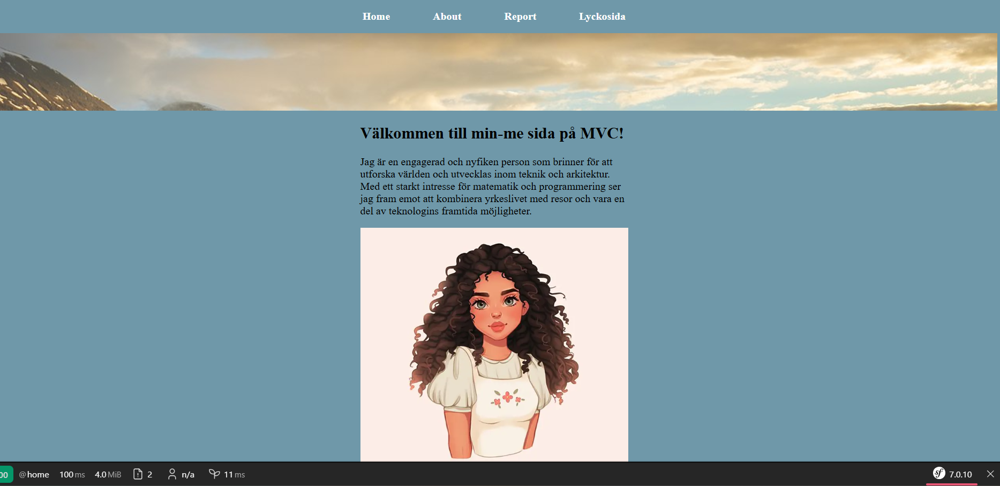

[](https://scrutinizer-ci.com/g/sakg23/mvc-24/?branch=main)
[](https://scrutinizer-ci.com/g/sakg23/mvc-24/?branch=main)
[](https://scrutinizer-ci.com/g/sakg23/mvc-24/?branch=main)
[](https://scrutinizer-ci.com/g/sakg23/mvc-24/?branch=main)

```markdown

# My Symfony Project


## Overview

Welcome to **My Symfony Project**! This project is a web application built with Symfony, showcasing various routes, JSON responses, and a structured API landing page. It demonstrates Symfony's powerful routing, controller, and response features to create a flexible and responsive application.

## Table of Contents

- [Overview](#overview)
- [Features](#features)
- [Getting Started](#getting-started)
- [Installation](#installation)
- [Running the Application](#running-the-application)
- [Available Routes](#available-routes)
- [Project Structure](#project-structure)
- [Card Game Implementation](#card-game-implementation)
- [Library CRUD](#library-crud)
- [Library JSON](#library-json)
- [Game Documentation](#game-documentation)
- [Transaction Management](#transaction-management)
- [License](#license)

## Features

- **API Landing Page**: A dedicated landing page for API routes, with links and descriptions of available endpoints.
- **Extensible Structure**: Easy to add more routes and functionality as needed.
- **Card Game (21)**: An interactive card game built on the popular "kortspel 21" game (Blackjack). This includes player vs. dealer mechanics, score calculation, and more.
  - **Deck Management**: View, shuffle, draw, and deal cards.
  - **Session Management**: Keep track of the current deck and drawn cards in user sessions.
  - **UML Class Diagram**: Visual representation of the card game system.
- **Documentation Page**: A route (`/game/doc`) containing a flowchart, pseudocode, and descriptions of the game classes.
- **Library CRUD**: A simple CRUD application for managing a library of books, where you can add, view, update, and delete books.
  - **Create**: Add a new book to the library with title, ISBN, author, and an image.
  - **Read**: View details of a specific book or see all books in a table format.
  - **Update**: Edit the details of an existing book.
  - **Delete**: Remove a book from the library.
- **Documentation Page**: A route (`/game/doc`) containing a flowchart, pseudocode, and descriptions of the game classes.
- **Transaction Management**: Allows users to add, edit, and delete income and expense transactions, as well as calculate median values for both categories.

## Getting Started

These instructions will help you set up the project on your local machine for development and testing.

### Prerequisites

Before you begin, ensure you have the following installed:

- **PHP 8.x**
- **Composer** (Dependency manager for PHP)
- **Symfony CLI** (Optional but recommended for easier server management)

## Installation

1. **Clone the Repository**

   Clone the repository to your local machine using Git:

   bash
   git clone https://github.com/sakg23/mvc-24.git
   

2. **Navigate to the Project Directory**

   bash
   cd mvc-24
   

3. **Install Dependencies**

   Use Composer to install the project's dependencies:

   bash
   composer install
   

4. **Set Up Environment Variables**

   Create a `.env.local` file to set up local environment variables if needed (e.g., database credentials).

### Testing
This project uses PHPUnit for unit testing, ensuring the correctness of the classes. 
Tests are automatically run with coverage via the `phpunit` script defined in `composer.json`.

**Running Tests with coverage** 

Use the following command to run the tests:

   bash
   composer phpunit
   
This will execute the tests and generate a code coverage report using Xdebug.


## Continuous Integration with Scrutinizer

This project uses **Scrutinizer** for automated code analysis to ensure high code quality. You can view the analysis results and score for this project by visiting the [Scrutinizer dashboard](https://scrutinizer-ci.com/g/sakg23/mvc-24).

### Setting Up Scrutinizer

To enable Scrutinizer for this project, follow these steps:

1. Go to [Scrutinizer](https://scrutinizer-ci.com) and log in or create an account.
2. Link your GitHub repository with Scrutinizer.
3. Scrutinizer will automatically detect the repository and start analyzing your code.

Once configured, Scrutinizer will run code analysis on every commit and pull request, providing feedback on potential issues and suggesting improvements.


### Running the Application

To start the application, use the Symfony CLI:

bash
symfony serve


If you're not using Symfony CLI, you can also use PHP’s built-in server:

bash
php -S localhost:8000 -t public


Once the server is running, open your browser and go to [http://localhost:8000](http://localhost:8000).

## Available Routes

The application provides the following routes:

- `/` or `/home` - **Home Page**: Renders the homepage with links to explore the site.
- `/about` - **About Page**: A simple "About" page with project information.
- `/api` - **API Landing Page**: Displays a summary of available JSON routes on this site.
- `/api/lucky/number` - **Lucky Number**: Returns a random - `/api/quote` - **Quote of the Day**: Returns a random quote with the current date and timestamp in JSON format.
- `/card` - **Card Game Home**: Shows the current number of cards in the deck.
- `/card/deck` - **Deck of Cards**: Displays all the cards in the deck, sorted by suit and value.
- `/card/deck/shuffle` - **Shuffle Deck**: Shuffles the deck and displays it.
- `/card/deck/draw/{number}` - **Draw Cards**: Draws a specified number of cards from the deck.
- `/card/session` - **Session Overview**: Displays the current session data, including the deck and drawn cards.
- `/card/session/delete` - **Clear Session**: Clears the session, including the deck.
- `/game` - **Game Home Page**: The main page for playing the game.
- `/game/doc` - **Game Documentation**: Detailed flowchart, pseudocode, and class descriptions.
- `/game/play` - **Start or Continue the Game**: Begins or continues the game.
- `/game/hit` - **Hit**: Draw a new card for the player.
- `/game/stand` - **Stand**: End the player's turn and let the dealer play.
- `/game/result` - **Show the Result**: Displays the result of the game, including the winner.
- `/game/reset` - **Reset the Game**: Starts a new round by resetting the game.
- `/library` - **Library Home**: Displays a list of books in the library.
- `/library/create` - **Create New Book**: Allows adding a new book to the library.
- `/library/book/{id}` - **View Book**: Displays the details of a specific book.
- `/library/update/{id}` - **Update Book**: Allows editing the details of an existing book.
- `/library/delete/{id}` - **Delete Book**: Deletes a book from the library.
- `/api/library/books` - **All Books in JSON**: Displays all books in the library in a JSON structure.
- `/api/library/book/{isbn}` - **Book by ISBN**: Displays a specific book by its ISBN in JSON format.
- `/proj` - **Transaction Home Page**: Displays the list of transactions with options to add, edit, or delete entries.
- `/proj/about` - **About the Transaction Project**: Explains the purpose of the transaction management system.
- `/proj/median/income` - **Median of Income**: Calculates and displays the median income of all transaction records.
- `/proj/median/expense` - **Median of Expense**: Calculates and displays the median expense of all transaction records.


### Flowchart
The flowchart representing the basic gameplay mechanics can be found on the documentation page. It illustrates the process of drawing cards, checking scores, and determining the winner.

### Pseudocode
The pseudocode for the game logic is as follows:

text
# Initialize Game
Initialize deck and shuffle
Create Player and Dealer with empty hands

# Player Turn
While Player's turn is active:
    Show player's current score
    If Player chooses "Hit":
        Draw card for Player
        If Player's score > 21:
            Player loses
            End game
    If Player chooses "Stand":
        End Player's turn

# Dealer Turn
While Dealer's score < 17:
    Draw card for Dealer
    If Dealer's score > 21:
        Dealer loses
        End game

# Determine Winner
If Player's score > Dealer's score:
    Player wins
Else If Dealer's score > Player's score:
    Dealer wins
Else:
    Dealer wins (on tie)
### Game Classes
The game logic uses several classes to represent the game entities and behavior. Here's a brief description of the key classes:

- *Card*: Represents a single card in the deck. Each card has a suit and value.
- *CardGraphic*: Inherits from the Card class and adds a graphical representation of the card (e.g., Ace of Spades as "A♠").
- *DeckOfCards*: Manages a deck of cards, providing methods to shuffle, draw, and reset the deck.
- *Game*: Controls the game flow, including dealing cards to the player and dealer, and determining the winner.
- *Player*: Represents a player (or dealer) with a hand of cards. It calculates the score based on the cards in hand, accounting for Ace value adjustments.
- *Dealer*: Inherits from Player and has logic specific to the dealer’s behavior (e.g., always hits until the score is at least 17).

## Library CRUD

The *Library CRUD* application allows managing a collection of books with the following functionalities:

- *Create*: Add a new book with title, ISBN, author, and an image to the library.
- *Read*: View a list of all books or the details of a single book.
- *Update*: Edit the details of an existing book.
- *Delete*: Remove a book from the library.

## Transaction Management

This section allows users to manage their income and expense transactions. Users can:

- *Add Transaction*: Add new income or expense entries.
- *Edit Transaction*: Edit the details of an existing transaction.
- *Delete Transaction*: Remove a specific transaction from the system.
- *View Transactions*: Display a list of all transactions, including amounts and categories.
- *Calculate Median*: Compute and display the median value for income and expense transactions.


## Project Structure

This project follows a standard Symfony structure with the following key folders:

- src/Controller: Contains controllers that manage routes and responses.
- templates/: Stores Twig templates for rendering HTML pages.
- config/: Contains configuration files, including routes and services.
- public/: The document root for the server, where the front controller (index.php) is located.

## License

This project is licensed under the MIT License. See the [LICENSE](LICENSE) file for details.

---

Happy coding! If you have any questions or encounter issues, feel free to open an issue or contact me directly.
```

---

### Explanation of Each Section

1. *Introductory Image*: Adds visual appeal at the top of the README.
2. *Overview*: Brief introduction to the project.
3. *Table of Contents*: Quick navigation for larger README files.
4. *Features*: Highlights key features of the application.
5. *Getting Started*: Provides prerequisites and setup steps for new users.
6. *Installation*: Detailed instructions to clone the repo and install dependencies.
7. *Running the Application*: Explains how to start the server and access the site.
8. *Available Routes*: Lists available routes with brief descriptions.
9. *Project Structure*: Explains the structure for easier navigation and understanding.
10. *License*: Specifies the project’s license.

This README.md is designed to give a complete overview of the project, help users get started quickly, and provide clear instructions for installation and usage.
# mvc-24